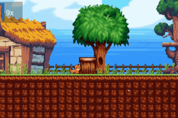
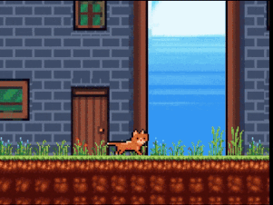
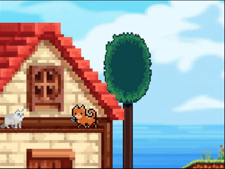

# 🧬 EvoluCat

**Geliştirici:** Taylan Özgür Özdemir  
**Okul:** İnönü Üniversitesi - Bilgisayar Mühendisliği  
**Proje Türü:** 2D Platformer/Metroidvania
**Oyun Motoru:** Unity 6 (6000.0.36f1)
**Dil:** C#  
**Durum:** Geliştirme aşamasında (0.6.8)

---

## 🐱 Oyun Hakkında

**EvoluCat**, ilaçla zekileşen bir kedinin hikayesini anlatan, bulmaca tabanlı bir 2D platformer/metroidvania oyunudur. Oyunda oyuncu; keşif, dövüş, çevresel etkileşim ve yavaş yavaş açılan yeni yeteneklerle hayvanlar üzerinde yapılan deneylerin arkasındaki gizem perdesini aralayacaktır.

---

## 🚧 Geliştirme Günlüğü

### 🔹 v0.1.0 – İlk Sürüm (🗓️ Mart 2025)

- ✅ **Temel Mekanikler Geliştirildi** (Küçük mahalle ortamı)
- 🧠 **Mekanikler:**
  - Yürüme/Koşma
  - Zıplama/Yüksek zıplama
  - Wall jump (duvara tutunma destekli)
  - Kutu itme/çekme
  - Pati ile saldırı
  - Fare taşıma ve etkileşim
- 🧩 Basit bulmaca ve platform öğeleri yerleştirildi
- 🐭 Düşman prototipleri: Fare

---

### 🔹 v0.3.2 – İkinci Sürüm (🗓️ Nisan 2025)

- ✅ **Chapter 1 tamamlandı** (Küçük mahalle ortamı)
- 🎨 Oyun içi HUD tasarımı ve animasyonları
- 💬 Basit diyalog sistemi eklendi (kod + UI)
- 📜 Chapter 1'in çizimsel geçişleri tamamlandı (çizgi roman tarzı)
- 🏗️ Platformlar ve engellerin yerleştirilmesi
- 🧱 Tırmanma alanları, zıplama mesafeleri, checkpoint sistemleri üzerinde ilk testler

---

### 🔹 v0.6.0 – Temel Mekanikler

- ✅ **Chapter 2 tamamlandı** (Gergin Kanalizasyon)
- 🎧 Tüm ses dosyaları ve Müzikler toplandı. (pixabay.com üzerinden)
- ☠ Canavar ve Platform tehtidleri eklendi.
- 📜 Chapter 2'in çizimsel geçişleri tamamlandı (çizgi roman tarzı)
- 🎮 Ana Menü sistemi eklendi.
- 💾 Kayıt&Yükleme sistemi oluşturuldu.

---

## 🔭 Roadmap

| Planlanan Özellikler          | Durum           |
|-------------------------------|-----------------|
| Laboratuvar (Chapter 3)       | 🔜 Planlanıyor |
| Telekinezi mekaniği           | 🔜 Planlanıyor |
| Boss Fight (Chapter 4)        | ⏳ Tasarımda    |
| Türkçe dil desteği            | 🟡 Düşünülüyor |
| Japonca dil desteği           | 🟡 Düşünülüyor |

---

## 📸 Ekran Görüntüleri

  

---

## 🛠️ Teknik Detaylar

- **Engine:** Unity 2022.3.18f1
- **IDE:** JetBrains Rider
- **Dil:** C#
- **Platform:** Windows x64
- **Assetler:** Unity Asset Store, [itch.io](https://itch.io), [OpenGameArt.org](https://opengameart.org), [GameDevMarket.com](https://www.gamedevmarket.net)

---

## 🗃️ Versiyonlama & İndirme Linkleri

Sürüm sistemi şu şekilde ilerlemektedir:  
`MAJOR.MINOR.PATCH`

- `0.1.0` = Temel Mekanikler
- `0.3.0` = Chapter 1 tamamlandığında
- `0.6.0` = Chapter 2 tamamlandığında
- `0.9.0` = Chapter 3 tamamlandığında
- `1.0.0` = Final sürüm, tüm chapter’lar ve mekanikler entegre

🎮 **[EvoluCat v0.6.8 İndir (Windows 64-bit)](https://example.com/evolucat_v0.6.8.zip)**  
📦 Dosya Boyutu: 140 MB | Yayın Tarihi: 26 Mayıs 2025

---

## ✉️ İletişim

> Geliştirici: [taylan147701@gmail.com]  
> GitHub: [@taylan1477](https://github.com/taylan1477)  

